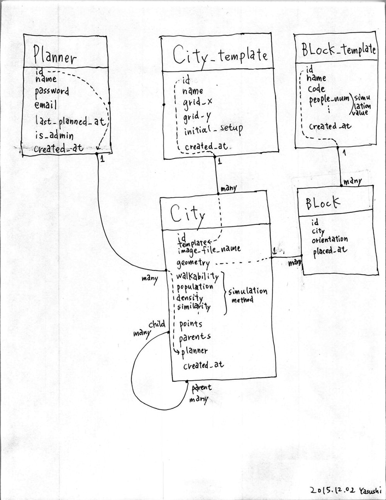

Example Jupyter Python Notebooks
================================

This repository is for my assignment for MAS500 programming strategy class.

Initially from https://github.com/rahulbot/notebook-examples
cloned by direction...

## Server diagram

This includes a few Jupyter Python Notebooks I use as examples in my teaching.

Installation
------------

These use a few super-handy libraries.  To install do `pip install -r requirements.pip`.

Running
-------

To start up Jupyter run `jupyter notebook` and it will open your web browser.

==================================
